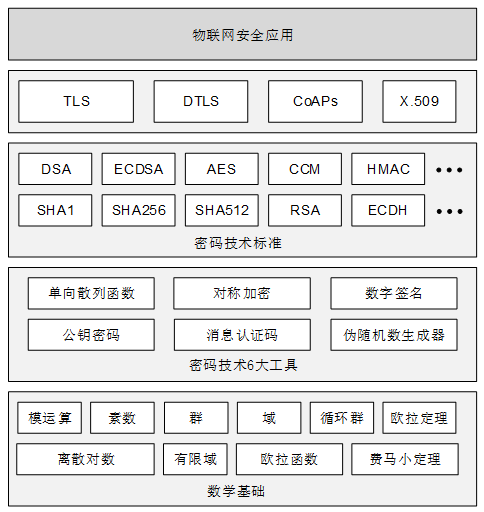

# 《密码技术与物联网安全:mbedtls实战》
## 图书简介
本书是国内第一本理论结合实践的物联网安全书籍，包括数论基础知识、密码学算法、TLS/DTLS协议、物联网安全协议CoAPs等部分。本书试图打破物联网工程师、嵌入式工程师与Web开发工程师之间的知识鸿沟，通过图文并茂的方式说明密码技术与物联网安全。
本书具有以下特点：
- 密码学算法部分除了理论知识之外，还包括mbedtls相关工具和示例代码，可以帮助读者更快地理解这些晦涩难懂的密码技术；
- 贴近物联网应用实战开发。本书基于嵌入式硬件平台描述密码学算法性能，通过具体示例代码分析密码学算法资源消耗情况，结合实战情况给出使用建议。
- 紧扣物联网安全发展趋势。认证加密算法部分，本书详细描述了认证加密算法CCM模式和GCM模式；椭圆曲线算法部分，本书详细描述了椭圆曲线密码算法的数学基础以及安全原理；
- TLS/DTLS协议部分。本书以物联网终端的角度详细描述TLS/DTLS协议的实现过程，按照密钥交换、密钥计算、对称加密等部分展开，并总结了物联网设备使用TLS/DTLS协议的建议；
- 物联网安全协议CoAPs部分。本书详细描述了物联网安全协议CoAPs，CoAPs依赖DTLS协议，它可在占用较少资源的情况下为物联网设备提供安全连接功能。

## 作者简介
### 徐凯
阿里云IoT开发工程师，花名左相。物联网技术实践者与研究者，对物联网传输协议、物联网安全和物联网数据存储有常深刻的认识与理解。多年嵌入式与物联网系统开发经验，涉猎终端设备，边缘计算与物联网平台等多个领域。编写大量关于物联网应用、物联网操作系统，物联网传输协议相关的技术博文，博文广受好评。著有《IoT开发实战 CoAP卷》

### 崔红鹏
资深嵌入式软件工程师，现就职于清华大学无锡应用技术研究院——微纳电子与系统芯片实验室。“CPU硬件安全动态监测管控技术”项目组成员，负责密码学算法实现和SDK开发，该项目曾获 “2018年世界互联网大会15项全球领先科技成果”。物联网安全爱好者，对嵌入式系统、密码学技术和安全应用方案有深入研究，积极参与开源项目，为GmSSL和zephyr等开源项目贡献过代码。

